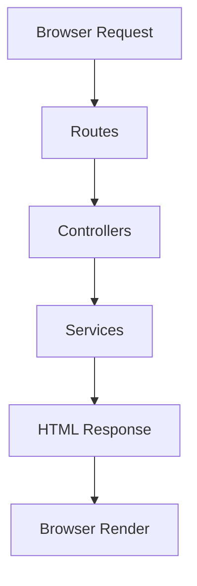

<p align="center">
  
</p>

<h1 align="center">🚀 Express Ecommerce Architecture</h1>

<p align="center">
  Scalable Node.js and Express.js backend architecture with routes, controllers, services, and HTML integration.
</p>

<p align="center">
  
  
  
  
</p>

---

# 📚 Overview

This project demonstrates a professional and scalable backend setup using:

- Node.js
- Express.js
- Routes
- Controllers
- Services
- HTML Integration using `res.sendFile()`

The application serves an HTML page through a GET API endpoint and follows a clean backend architecture pattern.

---

# ✨ Features

✅ Express Server Setup  
✅ Organized Folder Structure  
✅ REST API Routing  
✅ Controllers Pattern  
✅ Services Layer Pattern  
✅ HTML Integration  
✅ `res.sendFile()` Usage  
✅ Scalable Architecture  
✅ Beginner Friendly Backend Project

---

# 🏗️ Architecture



---

# 📁 Project Structure

```bash
express-ecommerce-architecture/
│
├── VIEW/
│   └── products.html
│
├── routes/
│   └── productRoutes.js
│
├── controllers/
│   └── productController.js
│
├── services/
│   └── productService.js
│
├── server.js
├── package.json
├── .gitignore
└── README.md
```

---

# ⚙️ Tech Stack

| Technology | Usage |
|---|---|
| Node.js | Runtime Environment |
| Express.js | Backend Framework |
| HTML | Frontend Rendering |
| JavaScript | Application Logic |

---

# 🚀 Getting Started

# 1️⃣ Clone Repository

```bash
git clone https://github.com/YOUR_USERNAME/express-ecommerce-architecture.git
```

---

# 2️⃣ Open Project

```bash
cd express-ecommerce-architecture
```

---

# 3️⃣ Install Dependencies

```bash
npm install
```

---

# 4️⃣ Run Server

```bash
node server.js
```

---

# 🌐 Open in Browser

```bash
http://localhost:3000/api/products
```

---

# 📄 API Endpoint

| Method | Endpoint | Description |
|---|---|---|
| GET | `/api/products` | Fetch all products and render HTML page |

---

# 🧠 How It Works

The application flow:

```txt
Browser Request
      ↓
Routes
      ↓
Controller
      ↓
Service
      ↓
HTML File Sent
      ↓
Browser Render
```

---

# 📦 Code Example

## Route

```js
router.get("/", getAllProducts);
```

---

## Controller

```js
res.sendFile(
  path.join(__dirname, "../VIEW/products.html")
);
```

---

## Service

```js
return "Fetching All Products";
```

---

# 📸 Output

The browser renders an HTML page displaying:

```txt
Fetching All Products
```

---

# 🔥 Concepts Covered

- Express Routing
- MVC Architecture Basics
- Controllers
- Services
- GET Requests
- HTML Integration
- res.sendFile()
- Clean Folder Structure

---

# 🚀 Future Improvements

- MongoDB Integration
- Authentication
- Product Database
- Dynamic HTML Rendering
- RESTful CRUD APIs
- JWT Authorization
- Docker Support

---

# 🤝 Contributing

Pull requests are welcome.

If you'd like to improve the project:

- Fork the repository
- Create a new branch
- Commit changes
- Open a Pull Request

---

# 📄 License

This project is licensed under the ISC License.

# 👨‍💻 Author

## Yashav Shukla

# ⭐ Support

If you like this project:

- Star the repository ⭐
- Fork the project 🍴
- Share with developers 🚀

---

<p align="center">
  Built with ❤️ using Node.js and Express.js
</p>